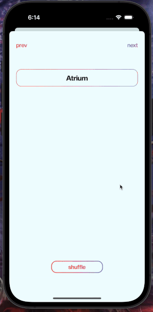

# flashcard mobile app
stylish modern flashcard application. simple to use and great for studying!

## set up directions
### downloading the zip file
1. Make sure XCode is installed on your computer
2. Download the zip file by going to **Code** in the top right corner, and click **Download ZIP**
3. Unzip the file
4. Open up XCode
5. Build & run the project

### clone the git
1. Make sure XCode is installed on your computer
2. Open up your terminal
3. Go to the directory/folder you would like to clone the project to
4. Type `git clone` + HTTPS link provided in **Code** in the top right corner
5. Open up XCode
6. Build & run the project

## create subject/deck

## adding new flashcard

## studying flashcards
* click to toggle between hiding & showing definition  
  

## swipe
* swipe left to go to prev
* swipe right to go to next  
  

## shuffle
* this restarts the deck  
  

## reorder functionality

## landscape orientation

